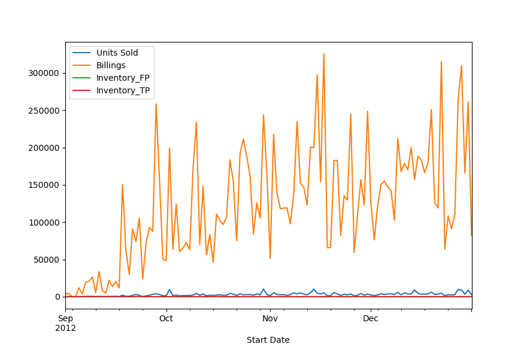
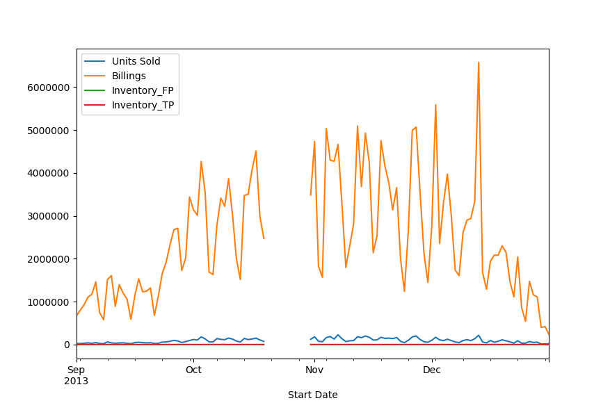
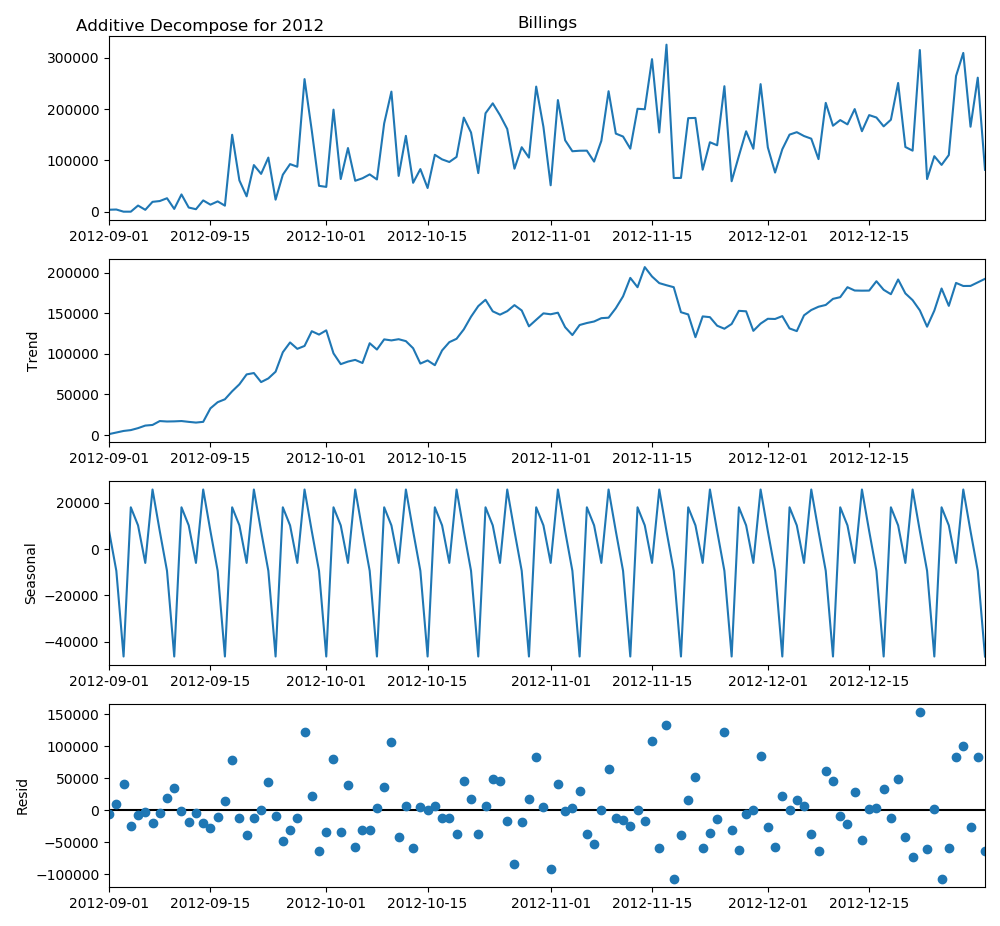
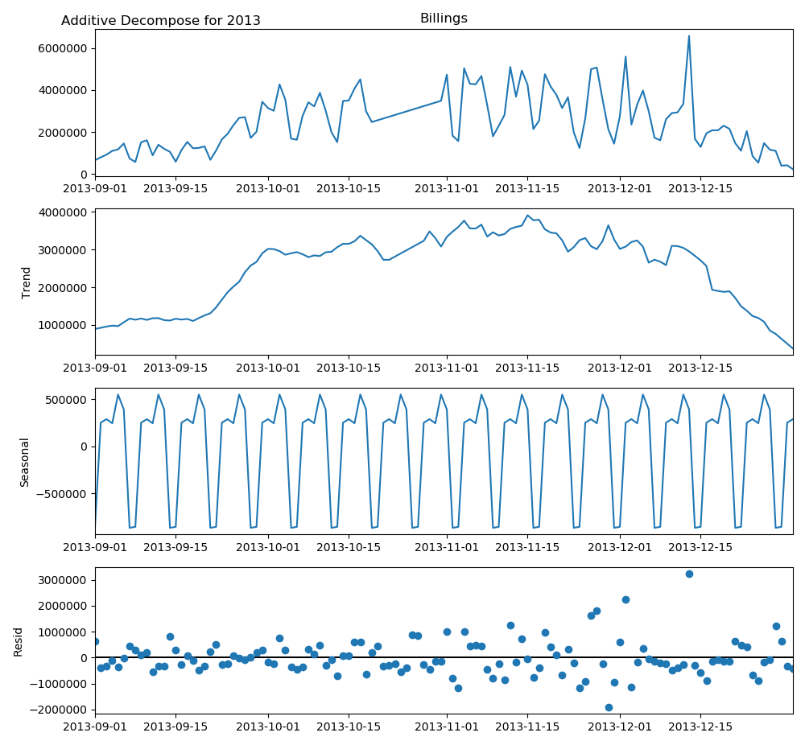

# YipitData Groupon Exercise

## Summary

This exercise aims to use the given data to estimate Groupon’s 4Q13 North America gross billings by segment. **Table 1** shows the billings estimate by segment.

<center>Table 1: Gross Billings Estimate for Three Segments</center>

| Segement | Billings Estimate ($ million) |
| :------: | :---------------------------: |
|  Local   |             442.0             |
|  Goods   |             282.2             |
|  Travel  |             70.6              |

Based on this estimate and the consideration of other available equity research reports, I recommend selling Groupon stock at this moment.


## Analysis

Here is a summary of what I did with the original data:

1. Checked the descriptive statistics for all variables.  Then checked distribution plots for continuous variables and count plots for categorical variables. I noticed that each row has a unique Deal ID, there are no duplicates. Also, there are no missing values in all columns.

2. Created dummy variables for the categorical variable Inventory Type. Split the dataset by three segments and rolled up each table to the Day level using sum. Added 11 empty rows for the time 2013-10-20 to 2013-10-30 in the Local segment.

3. Partitioned Local segment to two parts: 2012 September - December and 2013 September - December. Based on **Figure 1** and **Figure 2** shown below, it seems they have similar patterns.   

   <center> Figure 1. Plot for 2012 September to December </center>

   

   <center>Figure 2. Plot for 2013 September to December with Missing Data</center>

   Therefore, I tried to decomposite 2012’s data by considering the series as an additive combination of the base level, trend, seasonal index and the residual. **Figure 3** shows what it looks like. The reason I did not use the multiplicative decomposition here is that the data contains zeros.



<center>Figure 3. Additive Decomposition for 2012 September to December Data</center>

4. Tried several imputation methods (i.e. Simple Imputer in sklearn, Interpolation, MICE in R, kNN Imputer etc). Some of them just replicated same results for 11 times and some of them did not look that good. Finally, I decided to move forward with interpolation with `method=’time’`. After validating the same additive decomposition strategy applied to 2012 data, this imputation method is reliable because it has a similar trend and seasonal pattern with the Year 2012 and its residual part looks quite random (**Figure 4**).



<center>Figure 4. Additive Decomposition for 2013 September to December Data after Imputation</center>

5. After imputation, get the sum of billings across each segment, which is shown above in **Table 1**.
6. The similar imputation method was used when calucated the New Deals that started in Q4 2013 for the Local segment (details could be referred as the Python code file in **Appendix**). 


**Table 2** shown below summarizes the Billings, Units Sold and New Deals Started across different quarters in 2012 and 2013 based on historical data.

<center>Table 2: Summary of Key Metrics for Q3 2012 to Q4 2013 Data by Segments</center>

|                          |   Q3 2012    |   Q4 2012    |   Q1 2013    |   Q2 2013    |   Q3 2013    |       Q4 2013        |
| :----------------------: | :----------: | :----------: | :----------: | :----------: | :----------: | :------------------: |
| **Billings ($ million)** |              |              |              |              |              |                      |
|          Local           |    408.9     |    431.1     |    469.1     |    459.2     |    410.4     |        442.0*        |
|          Goods           |    110.5     |    213.7     |    144.3     |    201.6     |    191.5     |        282.2         |
|          Travel          |     46.5     |     49.7     |     56.5     |     64.6     |     66.9     |         70.6         |
|      **Units Sold**      |              |              |              |              |              |                      |
|          Local           | 13,626,329.4 | 15,599,997.4 | 15,685,070.9 | 16,156,293.5 | 14,866,064.8 |    14,992,623.0*     |
|          Goods           | 3,647,863.4  | 6,378,651.8  | 4,773,079.1  | 7,847,824.7  | 7,086,348.5  | **==10,419,746.0==** |
|          Travel          |  206,521.4   |  255,393.5   |  224,537.1   |  389,191.8   |  317,184.5   |      37,8910.0       |
|  **New Deals Started**   |              |              |              |              |              |                      |
|          Local           |    39,283    |    43,832    |    37,262    |    38,886    |    37,918    |       53,954*        |
|          Goods           |    1,307     |    3,159     |    3,688     |    6,550     |    8,530     |    **==12,749==**    |
|          Travel          |     705      |     866      |     636      |    1,258     |    1,614     |        2,177         |

**Note:** Values with asterisk are estimated by the imputation; Values highlighted in yellow are irregularities that might worth further investigation 


## Recommendations

Based on the estimates shown in **Table 2** and **Table 3** and compared with the other three equity research reports, it seems Groupon’s business growth slows down, especially its core business - Local segment. Therefore, I recommend selling Groupon stock.

<center>Table 3: Comparison of Billings with Prior Year and Quarter</center>

| **Billings ($ million)** | Q4 2013 | Change/Prior Year | Change/Prior Quarter |
| :----------------------: | :-----: | :---------------: | :------------------: |
|        **Local**         |  442.0  |       2.5%        |         7.7%         |
|        **Goods**         |  282.2  |       32.1%       |        47.4%         |
|        **Travel**        |  70.6   |       42.1%       |         5.6%         |


## Appendix

##### Python Code

```python
#!/usr/bin/env python3
# -*- coding: utf-8 -*-
"""
Created on Sat Jun 13 12:28:04 2020

@author: ***
"""
import os
import pandas as pd
import numpy as np
import seaborn as sns
import matplotlib.pyplot as plt

# Get current working directory
os.getcwd()

# Read Excel data
df = pd.read_excel (r'./data/raw/Q4_2013_Groupon_North_America_Data_XLSX (1).xlsx', sheet_name='Q4 2013 Raw Data')
df_backup = df.copy()
## 138534 obs, 7 vars

# =============================================================================
# EDA
# =============================================================================
# Define some functions
# For all variables
def dataframe_description(df, col):
    print('Column Name:', col)
    print('Number of Rows:', len(df.index))
    print('Number of Missing Values:', df[col].isnull().sum())
    print('Percent Missing:', df[col].isnull().sum()/len(df.index)*100, '%')
    print('Number of Unique Values:', len(df[col].unique()))
    print('\n')

# For continuous variables    
def descriptive_stats_continuous(df, col):
    print('Column Name:', col)
    print('Mean:', np.mean(df[col]))
    print('Median:', np.nanmedian(df[col]))
    print('Standard Deviation:', np.std(df[col]))
    print('Minimum:', np.min(df[col]))
    print('Maximum:', np.max(df[col]))
    print('\n')

# Plotting distribution plots for continuous variables
def plot_distribution(df, col):
    sns.set(style='darkgrid')
    ax = sns.distplot(df[col].dropna())
    plt.xticks(rotation=90)
    plt.title('Distribution Plot for ' + col)
    plt.show()
    
# Plotting count plots for categorical variables 
def plot_counts(df, col):
    sns.set(style='darkgrid')
    ax = sns.countplot(x=col, data=df)
    plt.xticks(rotation=90)
    plt.title('Count Plot')
    plt.show()

df.columns.values
## ['Deal ID', 'Units Sold', 'Billings', 'Start Date', 'Deal URL', 'Segment', 'Inventory Type']
continuous_vars = ['Units Sold', 'Billings']
categorical_vars = ['Start Date', 'Segment', 'Inventory Type']

for col in list(df.columns.values):
    dataframe_description(df, col)
## Each row is a unique Deal ID, no duplicates
## No missing value in all columns

for col in list(continuous_vars):
    descriptive_stats_continuous(df, col)
## Units Sold variable: minimum is -9100.0
## Billings variables: minimum is -218062.90099999993

for col in list(continuous_vars):
    plot_distribution(df, col)

for col in list(categorical_vars):
    plot_counts(df, col)

# Check if Units Sold is same sign with Billings
df_check = df.copy()
df_check['Units Sold x Billings'] = df_check['Units Sold'] * df_check['Billings']
df_check[df_check['Units Sold x Billings'] < 0]
## All rows Units Sold and Billings variables have the same sign

# Create indicator variable for 'First - Party' inventory
df['Inventory_FP'] = np.where(df['Inventory Type']=='First - Party', 1, 0)
df['Inventory_TP'] = np.where(df['Inventory Type']=='Third - Party', 1, 0)
df.drop(['Deal ID', 'Deal URL', 'Inventory Type'], axis = 1, inplace = True) 

# Split the dataset by segments
local = df[(df.Segment=='Local')]
goods = df[(df.Segment=='Goods')]
travel = df[(df.Segment=='Travel')]

# Aggregate each segament to Day level
local['Start Date'] = local['Start Date'].astype(str)
local['Start Date'] = pd.to_datetime(local['Start Date'])
local_agg = local.groupby(['Start Date'], as_index=True).agg({'Units Sold':'sum','Billings':'sum','Inventory_FP':'sum','Inventory_TP':'sum'})

goods['Start Date'] = goods['Start Date'].astype(str)
goods['Start Date'] = pd.to_datetime(goods['Start Date'])
goods_agg = goods.groupby(['Start Date'], as_index=True).agg({'Units Sold':'sum','Billings':'sum','Inventory_FP':'sum','Inventory_TP':'sum'})

travel['Start Date'] = travel['Start Date'].astype(str)
travel['Start Date'] = pd.to_datetime(travel['Start Date'])
travel_agg = travel.groupby(['Start Date'], as_index=True).agg({'Units Sold':'sum','Billings':'sum','Inventory_FP':'sum','Inventory_TP':'sum'})

# Sort local aggregated dataframe
local_agg_sorted = local_agg.sort_index()

# Split local dataframe to two parts - before 2013 and Year 2013
local_2013 = local_agg_sorted.loc['2013-01-01':'2013-12-31'] ## 354 obs (missing 11 days)
local_before_2013 = local_agg_sorted.loc[:'2012-12-31'] ## 150 obs

# Add 11 rows represent missing 11 days
local_2013_full = local_2013.asfreq(freq='1D')

# Join two dataframes vertically
local_agg_full_sorted = local_before_2013.append(local_2013_full) ## 515 obs

# Write dataframe to csv and pickle file
local_agg_full_sorted.to_csv('./data/clean/local_agg_full_sorted.csv')
local_agg_full_sorted.to_pickle('./data/clean/local_agg_full_sorted.pkl')

# =============================================================================
# Time Series Decomposition
# =============================================================================
# Focus on Sept to Dec because 2012, 2013 both have full data entries in this date range
local_2013_9_12 = local_agg_full_sorted.loc['2013-09-01':'2013-12-31'] # has 11 rows with missing values
local_2012_9_12 = local_agg_full_sorted.loc['2012-09-01':'2012-12-31'] 

# Plot two years's Spet to Dec
local_2013_9_12.plot()
local_2012_9_12.plot()
## have similar patterns

from statsmodels.tsa.seasonal import seasonal_decompose
# Additive Decomposition for 2012
result_add_2012 = seasonal_decompose(local_2012_9_12['Billings'], model='additive', extrapolate_trend='freq')
# Plot
plt.rcParams.update({'figure.figsize': (10,10)})
result_add_2012.plot().suptitle('Additive Decompose for 2012', fontsize=12, x=0.2)
plt.show()

# =============================================================================
# Imputation and Validation
# =============================================================================
# Plot with missing data
local_2013_9_12.plot()

# Method 1 - Simple Imputer -- not so good b/c all missing days are imputed as same
from sklearn.impute import SimpleImputer
local_si = SimpleImputer().fit_transform(local_2013_9_12)

# Method 2 - time Interpolation
# Works on daily and higher resolution data to interpolate given length of interval
local_time = local_2013_9_12.interpolate(method='time')
local_time.plot()

# Method 3 - MICE
# Export dataframe to csv for R
local_2013_9_12.to_csv('./data/clean/local_2013_9_12.csv')

# Import R's MICE imputation result
local_mice = pd.read_csv(r'./data/clean/local_mice.csv')
local_mice.set_index('Start.Date', inplace=True)
local_mice.plot()

# Method 4 - kNN -- not so good b/c all missing days are imputed as same
from sklearn.impute import KNNImputer
local_knn = KNNImputer(n_neighbors=5).fit_transform(local_2013_9_12)
local_knn = pd.DataFrame(local_knn)
local_knn.index = list(local_2013_9_12.index) 
local_knn.plot()

# Additive Decomposition for 2013 after imputation
result_add_2013 = seasonal_decompose(local_time['Billings'], model='additive', extrapolate_trend='freq')
# Plot
plt.rcParams.update({'figure.figsize': (10,10)})
result_add_2013.plot().suptitle('Additive Decompose for 2013', fontsize=12, x=0.2)
plt.show()

# Combined with the dataset that before 2013 Sept
local_before_2013_9 = local_agg_full_sorted.loc[:'2013-08-31']
local_all_time = local_before_2013_9.append(local_time)

# =============================================================================
# Get sum of each segment
# =============================================================================
local_all_time.sum(axis = 0, skipna = True)/1000000
# Units Sold       14.992623
# Billings        442.018623

goods_agg.sum(axis = 0, skipna = True)/1000000
# Units Sold       10.419746
# Billings        282.245671

travel_agg.sum(axis = 0, skipna = True)/1000000
# Units Sold       0.378910
# Billings        70.552062

# =============================================================================
# Get New Deal Started Counts in Q4 2013
# =============================================================================
travel_q4 = travel[travel['Start Date'] > '2013-09-30']
## 2177 new deals added in Q4 2013 

goods_q4 = goods[goods['Start Date'] > '2013-09-30']
## 12749 new deals added in Q4 2013 

# Deal with Local segment with missing data - roll up using count
local_agg_counts = local.groupby(['Start Date'], as_index=True).count()

# Partition data after 2012-9-1 b/c no missing value after this date
local_agg_counts_after_20120901 = local_agg_counts.loc['2012-09-01':]

# Add 11 days missing data in 2013-10-20 to 2103-10-30
temp = local_agg_counts_after_20120901.asfreq(freq='1D')

# Remove redudant columns and rename the column
local_counts = temp[['Units Sold']]
local_counts.columns = ['Counts']
local_counts.plot()

# Impute counts with the interpolation method used above
local_counts_imputed = local_counts.interpolate(method='time')
local_counts_imputed.plot()

local_q4_counts = local_counts_imputed.loc['2013-10-01':]
local_q4_counts.sum()
## 53954 new deals added in Q4 2013 (estimated)
```


##### R Code for MICE Imputation

```R
library(mice)
# Read CSV file that exported from Python
local <- read.csv(file = './data/clean/local_2013_9_12.csv')

# Impute missing values using mice
local_imputed <- mice(data=local, m=5, method="cart", maxit=20, where = is.na(local))
# Pick one of the inerations to be the complete data
local_completeData <- complete(local_imputed, 5)

# Check how well mice imputed NA's
sum(is.na(x.completeData))
## All NAs are in Invetory_FP
# Replace NAs with 0
local_completeData[is.na(local_completeData)] <- 0

# Export mice imputation result to CSV
write.csv(local_completeData,'./data/clean/local_mice.csv', row.names = FALSE)
```

